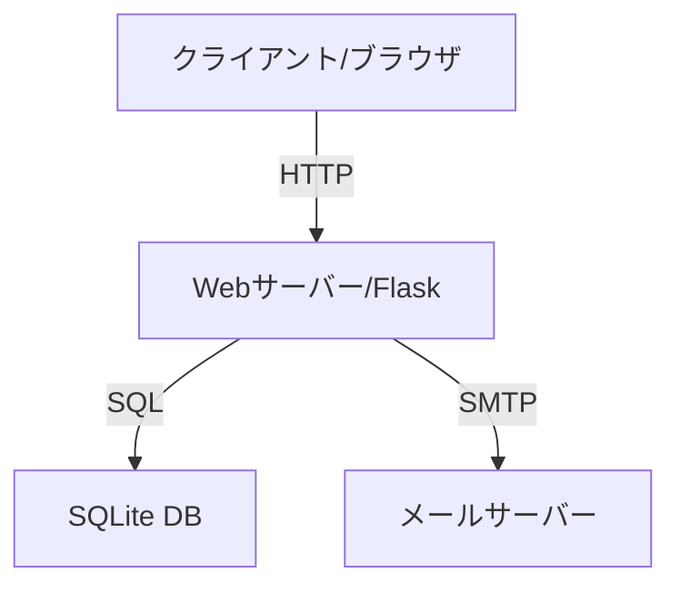

# バックエンド要件定義書

## 1. プロジェクトの目的
ペットホテル・トリミングサービスのLPサイト（main.html）に、お問い合わせ管理、予約管理、メール通知の機能を追加し、顧客とのコミュニケーションを効率化する。

## 2. 実現したい機能
### 2.1 お問い合わせフォーム機能
- お問い合わせデータの永続化
- 管理者への通知
- 送信者への自動返信

### 2.2 予約システム機能
- オンラインでの予約受付
- 予約状況の管理（確定、キャンセル待ち等）
- 予約の重複防止
- 予約者への自動返信

### 2.3 メール通知機能
- お問い合わせ受付時の通知
- 予約受付時の通知
- 管理者とユーザー双方への適切な通知

## 3. 非機能要件
### 3.1 セキュリティ要件
- 個人情報の安全な取り扱い
- 不正アクセスの防止
- データの暗号化

### 3.2 パフォーマンス要件
- レスポンスタイム: 3秒以内
- 同時接続数: 10ユーザー程度（練習用）

### 3.3 運用・保守要件
- エラー発生時のログ記録
- バックアップの取得
- システム状態の監視

## 4. 制約条件
### 4.1 技術的制約
- 練習用プロジェクトのため、無料で利用可能なツール・サービスを使用
- 開発言語はPythonを使用

### 4.2 その他の制約
- 個人情報保護法の遵守
- アクセシビリティへの配慮

## 5. 開発優先順位
1. お問い合わせフォーム機能
2. 予約システム機能
3. メール通知機能

## 6. システム構成
### 6.1 開発環境
- 開発言語: Python
- データベース: SQLite（練習用）
- Webフレームワーク: Flask

### 6.2 システム構成図


## 7. 機能要件
### 7.1 お問い合わせフォーム機能
#### 7.1.1 概要
ユーザーからのお問い合わせを受け付け、データベースに保存する機能

#### 7.1.2 詳細要件
- 保存対象データ:
  - 氏名
  - メールアドレス
  - 電話番号
  - お問い合わせ内容
  - 送信日時
- データベーステーブル設計:
  ```sql
  CREATE TABLE contacts (
      id INTEGER PRIMARY KEY AUTOINCREMENT,
      name TEXT NOT NULL,
      email TEXT NOT NULL,
      phone TEXT,
      message TEXT NOT NULL,
      created_at TIMESTAMP DEFAULT CURRENT_TIMESTAMP
  );
  ```
- バリデーションルール:
  - 氏名: 必須
  - メールアドレス: 必須、メールアドレス形式
  - 電話番号: 任意、数字のみ
  - お問い合わせ内容: 必須

### 7.2 予約システム連携機能
#### 7.2.1 概要
予約フォームからの情報をデータベースに保存する機能

#### 7.2.2 詳細要件
- 保存対象データ:
  - ペットの種類
  - サービスの種類（トリミング/ホテル）
  - 希望日時
  - オーナー情報（氏名、連絡先）
- データベーステーブル設計:
  ```sql
  CREATE TABLE reservations (
      id INTEGER PRIMARY KEY AUTOINCREMENT,
      pet_type TEXT NOT NULL,
      service_type TEXT NOT NULL,
      desired_date DATE NOT NULL,
      desired_time TIME NOT NULL,
      owner_name TEXT NOT NULL,
      owner_email TEXT NOT NULL,
      owner_phone TEXT,
      status TEXT NOT NULL DEFAULT 'pending', -- 予約ステータス (pending, confirmed, canceled)
      created_at TIMESTAMP DEFAULT CURRENT_TIMESTAMP
  );
  ```
- バリデーションルール:
  - 全ての項目（電話番号を除く）を必須とする
  - 同一日時に同一サービスの予約が既に存在しないこと（`confirmed` ステータスの場合）

### 7.3 メール通知機能
#### 7.3.1 概要
お問い合わせや予約が入った際に、管理者とユーザーにメール通知を送信する機能

#### 7.3.2 詳細要件
- 通知トリガー:
  - お問い合わせフォーム送信時
  - 予約フォーム送信時
- メールテンプレート:
  - 管理者向け通知
  - ユーザー向け自動返信
- SMTPサーバー設定が必要
- XSS対策
- CSRF対策
- 入力値のサニタイズ

## 8. 開発ステップ
1. 開発環境のセットアップ (`.env`ファイルの準備含む)
2. データベースの作成とテーブル設計
3. APIエンドポイントの実装
4. フォームのバリデーション実装
5. メール通知機能の実装
6. セキュリティ対策の実装
7. テストとデバッグ

---
**[改訂履歴]**
- YYYY-MM-DD: 初版作成 (AI Assistant) 