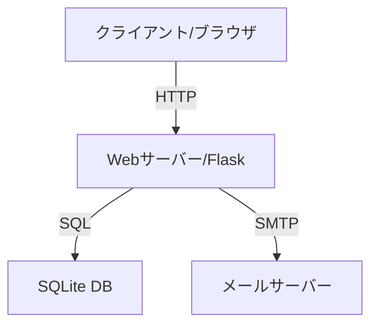

# バックエンド技術仕様書

## 1. システム構成
### 1.1 開発環境
- 開発言語: Python 3.8以上
- Webフレームワーク: Flask 2.0以上
- データベース: SQLite 3
- 開発ツール: 
  - pip (パッケージ管理)
  - python-dotenv (環境変数管理)
  - flask-sqlalchemy (O/Rマッパー)

### 1.2 システム構成図


## 2. データベース設計
### 2.1 テーブル定義
#### contacts テーブル
```sql
CREATE TABLE contacts (
    id INTEGER PRIMARY KEY AUTOINCREMENT,
    name TEXT NOT NULL,
    email TEXT NOT NULL,
    phone TEXT,
    message TEXT NOT NULL,
    created_at TIMESTAMP DEFAULT CURRENT_TIMESTAMP
);
```

#### reservations テーブル
```sql
CREATE TABLE reservations (
    id INTEGER PRIMARY KEY AUTOINCREMENT,
    pet_type TEXT NOT NULL,
    service_type TEXT NOT NULL,
    desired_date DATE NOT NULL,
    desired_time TIME NOT NULL,
    owner_name TEXT NOT NULL,
    owner_email TEXT NOT NULL,
    owner_phone TEXT,
    status TEXT NOT NULL DEFAULT 'pending',
    created_at TIMESTAMP DEFAULT CURRENT_TIMESTAMP
);
```

## 3. APIエンドポイント設計
### 3.1 お問い合わせAPI
#### POST /api/contact
- リクエスト:
  ```json
  {
    "name": "string",
    "email": "string",
    "phone": "string",
    "message": "string"
  }
  ```
- レスポンス:
  - 成功時 (200):
    ```json
    {
      "status": "success",
      "message": "お問い合わせを受け付けました"
    }
    ```
  - エラー時 (400):
    ```json
    {
      "status": "error",
      "message": "エラーメッセージ"
    }
    ```

### 3.2 予約API
#### POST /api/reservation
- リクエスト:
  ```json
  {
    "pet_type": "string",
    "service_type": "string",
    "desired_date": "YYYY-MM-DD",
    "desired_time": "HH:MM",
    "owner_name": "string",
    "owner_email": "string",
    "owner_phone": "string"
  }
  ```
- レスポンス:
  - 成功時 (200):
    ```json
    {
      "status": "success",
      "message": "予約を受け付けました",
      "reservation_id": "integer"
    }
    ```
  - エラー時 (400):
    ```json
    {
      "status": "error",
      "message": "エラーメッセージ"
    }
    ```

## 4. エラーハンドリング仕様
### 4.1 エラーコード定義
- 400: バリデーションエラー
- 404: リソース未発見
- 409: 予約重複エラー
- 500: サーバー内部エラー

### 4.2 エラーレスポンスフォーマット
```json
{
  "status": "error",
  "code": "エラーコード",
  "message": "エラーメッセージ",
  "details": {} // オプショナル
}
```

## 5. セキュリティ実装
### 5.1 入力バリデーション
- フロントエンド: 
  - HTML5 バリデーション
  - JavaScript による事前チェック
- バックエンド:
  - Flask-WTF によるフォームバリデーション
  - SQLAlchemy による型チェック

### 5.2 セキュリティヘッダー
```python
# セキュリティヘッダーの設定
response.headers['X-Content-Type-Options'] = 'nosniff'
response.headers['X-Frame-Options'] = 'DENY'
response.headers['X-XSS-Protection'] = '1; mode=block'
```

## 6. 環境変数設定
### 6.1 必要な環境変数
```env
FLASK_ENV=development
DATABASE_URL=sqlite:///database.db
MAIL_SERVER=smtp.gmail.com
MAIL_PORT=587
MAIL_USERNAME=your-email@gmail.com
MAIL_PASSWORD=your-app-password
MAIL_USE_TLS=True
```

## 7. テスト仕様
### 7.1 単体テスト
- テストフレームワーク: pytest
- テスト対象:
  - APIエンドポイント
  - バリデーション
  - データベース操作
  - メール送信

### 7.2 テストデータ
```python
# テストデータの例
test_contact = {
    "name": "テスト太郎",
    "email": "test@example.com",
    "phone": "090-1234-5678",
    "message": "テストメッセージ"
}
``` 